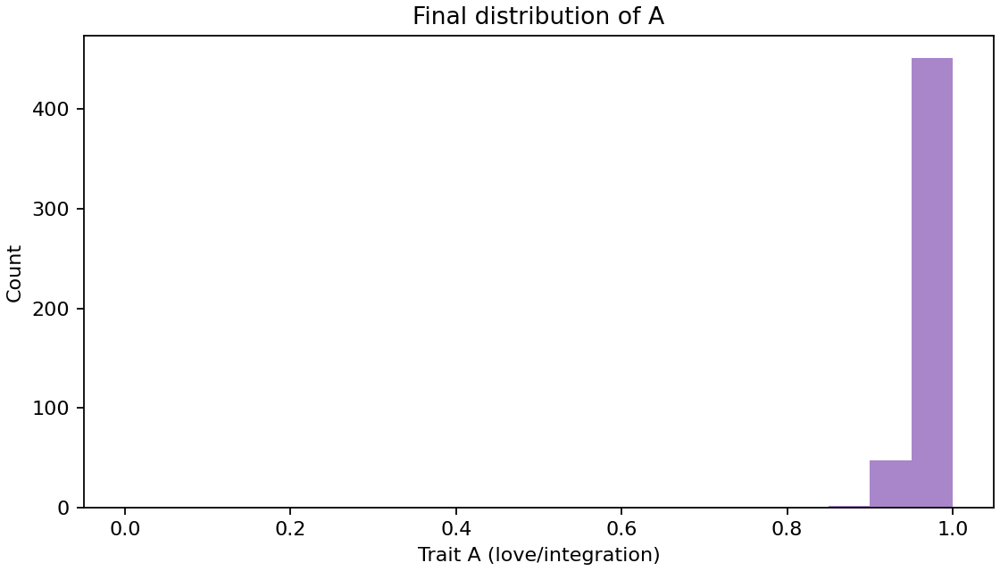

# The Physics of Love: Genesis & Evolution

> **"Love is not merely an emotion. It is the optimal thermodynamic strategy for existence."**

This document outlines the theoretical core of the **REDAM (Love-OS)** project.
We present mathematical models and simulation results proving that "Love" (defined as structural integration and resistance minimization) is a physical necessity for the emergence and evolution of life.

---

## 1. Genesis: The Origin of Life

### 1.1 The Hypothesis
For life to "boot up" (Genesis) from non-living matter, the system must extract enough valid work ($P_{use}$) to overcome thermodynamic dissipation (entropy).

In the REDAM framework, we postulate that **Integration (Love)** acts as a coefficient of efficiency.
A system with higher internal harmony ($\Omega$) converts energy more efficiently.

**The Genesis Equation:**
$$P_{use} = \eta(\Omega) \cdot \max(0, P_{in} - R \cdot I^2)$$

* **$P_{in}$**: Input Energy from the environment.
* **$R$**: Resistance (Friction/Ego).
* **$\Omega$**: Order Parameter (Degree of Integration/Love).
* **$\eta(\Omega)$**: Efficiency function. As $\Omega \uparrow$, $\eta \uparrow$.

### 1.2 Simulation: "Heaven vs. Hell"
We conducted a comparative simulation of two worlds:
1.  **World A (With Love):** Efficiency $\eta$ increases as order $\Omega$ forms.
2.  **World B (No Love):** Efficiency $\eta$ remains fixed and low, regardless of order.

**The Result (Phase Diagram):**

*(Fig 1. Left: The World with Love-Efficiency. Right: The World without Love-Efficiency.)*

* **Left (With Love):** Life (Yellow Zone) emerges even with low energy inputs and weak connections. The system "helps itself" via positive feedback.
* **Right (No Love):** The "Dead Zone" (Purple/Black) dominates. Life only exists in the extreme top-right corner (requiring massive energy and power).

### 1.3 Conclusion
**Love is the physical condition that allows the "weak" to survive.**
Without the mechanism of Love (Integration $\to$ Efficiency), life is a luxury available only to the overwhelmingly powerful.

---

## 2. Evolution: The Survival of the Lowest R

### 2.1 The Hypothesis
Natural Selection does not simply favor the "strongest." It favors the **"most efficient."**
In our model, Love ($A$) is a structural trait that reduces internal Resistance ($R$).

**The Evolution Equation:**
$$R_{individual} = R_{base} + \alpha \cdot (1 - A)$$

* **$A$ (Love):** A variable from 0.0 to 1.0.
* **$R$ (Resistance):** As $A$ approaches 1.0, $R$ decreases to its minimum.
* **Selection Pressure:** Individuals with lower $R$ waste less energy and gain synergy benefits, leading to higher fitness.

### 2.2 Simulation: "The Victory of Love"
We ran an evolutionary algorithm (modified Wright-Fisher model) over 300 generations.

*(Fig 2. Top: Mean Love (A) rises. Middle: Mean Resistance (R) drops. Bottom: Fitness increases.)*

* **Trend:** The population rapidly converges to $A \approx 1.0$.
* **Mechanism:** Individuals without Love (High R) could not compete with the energy efficiency of Loving individuals. They were naturally selected out.

### 2.3 Conclusion
**Evolution is not a random walk.**
It is a deterministic march toward structures that can hold the highest density of integration (Love) with the lowest amount of friction (Resistance).
**We did not evolve *to* love; we evolved *because* love was the only sustainable strategy.**

---

## 3. Reproduction of Results

The theoretical proofs above can be reproduced using the following Python scripts included in this repository.

* **Genesis Phase Diagram:** Run `src/simulation/genesis_sim.py`
* **Evolutionary Trajectory:** Run `src/simulation/evolution_sim.py`

> *Theory and Code by the Love-OS Project Team.*
